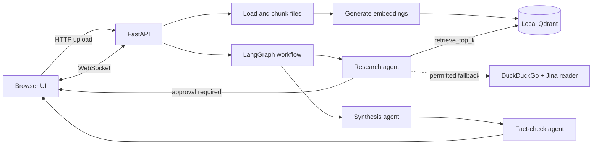

# Research Agent Assessment

An evidence-grounded research assistant built by **Vinayak Mishra**. The application lets a user upload personal documents, ask research questions, and receive answers supported by the uploaded files and, when explicitly permitted, web sources.

## Demo

- **Live application:** [research-agent-flax.vercel.app](https://research-agent-flax.vercel.app/)
- **Backend health check:** [research-agent-ez0j.onrender.com/health](https://research-agent-ez0j.onrender.com/health)
- **Video demo:** [YouTube Video](https://youtu.be/jYEuC32C-z4)

## What the application does

The application combines retrieval-augmented generation (RAG), web research, and a multi-step LangGraph workflow:

1. A user identifies a session with a name and uploads one or more documents.
2. The backend parses supported files and splits their text into overlapping chunks.
3. Each chunk is embedded and stored in a local Qdrant collection with its source filename and session ID.
4. A research agent searches the user's documents first and records facts together with their sources.
5. The agent can ask the user for clarification before using the web tools.
6. A synthesis agent writes a Markdown answer from the collected research notes.
7. A fact-checking agent reviews the draft, removes unsupported claims, and returns a corrected answer.
8. Progress updates are sent to the browser over WebSockets while the workflow is running.

## Features

- Multi-file ingestion for PDF, TXT, Markdown, DOCX, CSV, XLSX, and JSON files
- Recursive text chunking with a 500-character chunk size and 100-character overlap
- Session-scoped semantic retrieval using Qdrant and cosine similarity
- Document-first research with optional DuckDuckGo web search
- Batch webpage reading and relevance-focused webpage summaries
- Human-in-the-loop clarification using LangGraph interrupts and resume commands
- Structured research notes and interactions validated with Pydantic models
- Citation-aware Markdown answers
- Independent fact-checking and correction of unsupported claims
- Real-time agent/tool activity displayed in the chat interface
- Uploaded-file listing, download links, and in-chat file uploads
- Path and filename sanitization for uploaded files

## Architecture

<div align="center">
    
</div>

The diagram above provides a visual overview of the document ingestion, retrieval, agent orchestration, and answer-generation flow. The Mermaid diagram below shows the same flow in a format that can be rendered directly by GitHub.



## Workflow in detail

### 1. Document ingestion

The setup page accepts multiple files. `app.py` saves them under `uploads/<session>/` after sanitizing the session name and filename. `file_loaders.py` selects a parser based on the extension:

```text
file → loader → plain text → RecursiveCharacterTextSplitter
     → embeddings → Qdrant points
```

Every Qdrant point stores the chunk text, source path, chunk index, and session ID. This metadata allows retrieval to be isolated to the current user's session and allows citations to link back to uploaded files.

### 2. Research agent

The research agent receives the current question and the complete workflow state. It is instructed to:

- Search the vector database first using short queries and a small top-$k$ value.
- Preserve existing research notes and avoid repeating work.
- Ask the user before using web search.
- Use DuckDuckGo to find relevant pages and the Jina reader endpoint to obtain readable webpage content.
- Record only facts that have supporting evidence.

The agent returns structured `interactions` and `research_notes` values rather than an unstructured research transcript.

### 3. Human-in-the-loop clarification

When the research agent needs clarification, the `ask_user` tool calls a LangGraph `interrupt`. The graph pauses with its checkpoint preserved. The FastAPI WebSocket sends the question to the browser, waits for the user's response, and resumes the graph with `Command(resume=...)`.

### 4. Synthesis

The synthesis agent receives the original question, user interactions, and verified research notes. It produces a Markdown answer using only those notes. Claims are expected to include citations in the form `[label](source)`.

### 5. Fact-checking

The final workflow node reviews the draft claim by claim. It can retrieve additional evidence when the notes are insufficient, marks corrections or unsupported claims, and rewrites the answer so that unsupported information is removed. The result includes both the verified answer and a structured list of corrections.

## Repository structure

```text
.
├── app.py              # FastAPI routes, uploads, file serving, and WebSocket endpoint
├── agents.py           # Research, synthesis, and fact-checking agents
├── graph.py            # LangGraph state, nodes, edges, and checkpointed pipeline
├── tools.py            # Web search, webpage reading, and webpage summarization
├── vector_DB.py        # Embeddings, Qdrant setup, indexing, and retrieval
├── file_loaders.py     # PDF, text, DOCX, tabular, and JSON loaders
├── chuncking.py        # Recursive text chunking
├── frontend/           # Static setup and chat pages
├── Arch diagram.png    # Visual system architecture diagram
├── Files/              # Example/reference documents
├── uploads/            # Per-session uploaded files
└── data/qdrant/        # Local Qdrant storage
```

## Requirements

- Python 3.11 or newer
- An API Credits/OpenAI-compatible API key
- Internet access for model requests and optional web research
- Windows, macOS, or Linux

## Installation

```bash
git clone https://github.com/Vinayak2005917/Research-Agent.git
cd Research-Agent
python -m venv .venv
```

Activate the virtual environment:

**Windows PowerShell**

```powershell
.\.venv\Scripts\Activate.ps1
```

**macOS/Linux**

```bash
source .venv/bin/activate
```

Install dependencies:

```bash
pip install -r requirements.txt
```

## Configuration

Create a `.env` file in the project root:

```env
OPENAI_API_KEY=your_api_key_here
```

The application uses the OpenAI-compatible API at `https://api.aicredits.in/v1`. The chat model is configured as `openai/gpt-5.6-luna`; webpage summaries use `google/gemini-2.5-flash-lite`.

Optional settings:

```env
EMBEDDING_MODEL=text-embedding-3-small
UPLOAD_ROOT=./uploads
```

Do not commit `.env` or expose API keys in frontend code.

## Running locally

Start the FastAPI server from the repository root:

```bash
uvicorn app:app --reload --host 0.0.0.0 --port 8000
```

Open [http://localhost:8000](http://localhost:8000). The frontend automatically uses the local backend when opened on `localhost` or `127.0.0.1`.

To index the example files in `Files/` into the `public` session:

```bash
python vector_DB.py
```

The setup page can also upload and index files for a new session. On first startup, `vector_DB.py` probes the configured embedding model to determine the vector size and creates the local Qdrant collection if it does not already exist.

## API and WebSocket endpoints

| Endpoint | Purpose |
| --- | --- |
| `GET /` | Serves the setup page |
| `GET /health` | Returns the backend health status |
| `GET /generate_thread_id` | Creates a new random thread ID |
| `POST /setup` | Saves and indexes initial files as an NDJSON progress stream |
| `POST /upload` | Uploads and indexes files during an existing session |
| `GET /files/{username}` | Lists files for a session |
| `GET /files/{username}/{filename}` | Serves an uploaded file for citations |
| `WS /ws/{thread_id}` | Receives chat messages and streams agent events/responses |

WebSocket messages sent by the client use `{ "type": "message", "content": "..." }`. During an interrupt, the client replies with `{ "type": "answer", "content": "..." }`.

## Data and privacy notes

- Qdrant uses local on-disk storage at `data/qdrant`.
- Uploaded files are stored locally under `uploads/<session>/` by default.
- The configured language model and webpage summarizer receive the prompts/content required for their requests.
- Session IDs currently use the user-provided name for document filtering; this is convenient for the demo but is not an authentication system.
- The default graph checkpointer is `InMemorySaver`, so workflow checkpoints are lost when the backend process restarts.
- Review and secure CORS, upload limits, authentication, and persistent checkpoint storage before production use.

## Limitations and future improvements

- Add authentication and authorization around sessions and uploaded files.
- Use persistent LangGraph checkpoints for restart-safe conversations.
- Add file size/type limits, antivirus scanning, and upload rate limiting.
- Replace local Qdrant storage with a managed or server-hosted Qdrant deployment for multiple backend instances.
- Add automated tests for loaders, retrieval filters, WebSocket messages, and citation rendering.
- Add a dedicated video demonstration and deployment instructions for the frontend/backend services.

## License

No license has been specified yet. Add a license file before distributing or reusing this project.